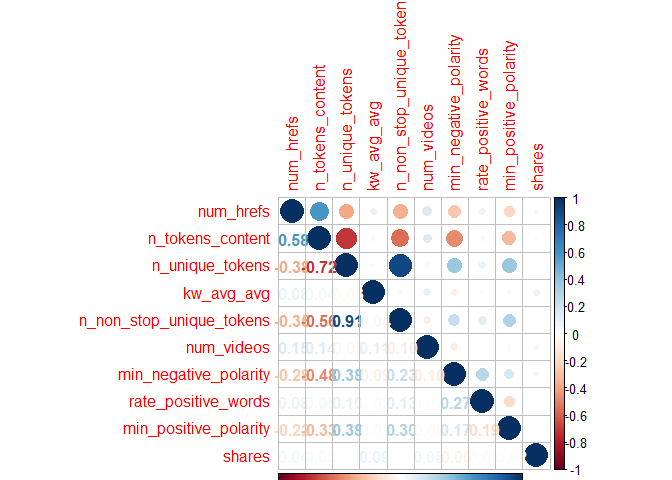
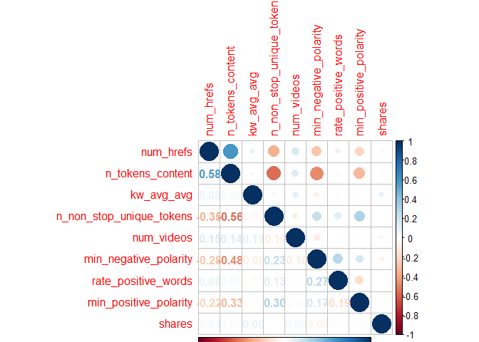
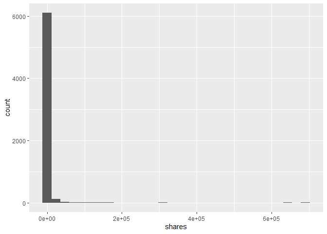
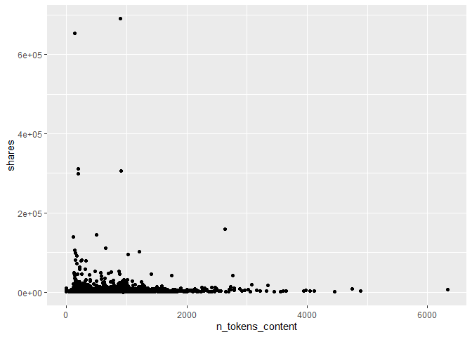
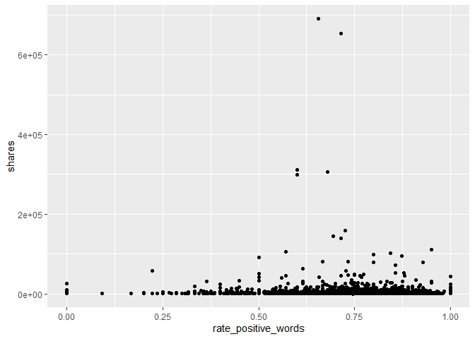

project-3
================
Justin Feathers
2022-11-01

# Introduction

Describes the data and variables we want to use. Target is `shares`

``` r
library(tidyverse)
library(corrplot)
library(caret)
```

# Data

``` r
newsData <- read_csv(file = "./OnlineNewsPopularity.csv")
data <- newsData %>% 
            filter(get(paste0("data_channel_is_", params$channel)) == 1) %>%
              select(-url, -timedelta)
```

# Summarizations

A good way of starting is by checking how strongly all variables are
correlated to the response variable of interest. I created a correlation
matrix using the `cor` function and sorted the absolute values of the
output to get a convenient tibble of descending correlation values.

From here, we can look at a correlation plot of the chosen variables to
see if multicollinearity exists between any of the variables. Using
`corrplot`, we can see that the variables `n_unique_tokens` and
`n_tokens_content` have a strong negative correlation of -0.73. There is
an extremely strong positive correlation of 0.93 between
`n_unique_tokens` and `n_non_stop_unique_tokens` – we will try dropping
`n_unique_tokens` from the dataset and reassessing. We can see in the
new `corrplot` that multicollinearity has been minimized as desired.

We can analyze a few of the variables by plotting them against `shares`.
If we create a scatter plot of `num_imgs` by `shares`, we can see an
outlier when `num_imgs` = 1. Let’s remove that.

``` r
dataCor <- cor(data$shares, data) %>%
        as.tibble() %>%
        abs() %>%
        sort(decreasing = TRUE)
dataCor
```

    ## # A tibble: 1 x 53
    ##   shares self_reference_mi~ self_reference_~ kw_avg_avg self_reference_~ LDA_03 avg_negative_po~ min_negative_po~ kw_max_avg
    ##    <dbl>              <dbl>            <dbl>      <dbl>            <dbl>  <dbl>            <dbl>            <dbl>      <dbl>
    ## 1      1              0.111            0.105     0.0872           0.0757 0.0644           0.0621           0.0606     0.0546
    ## # ... with 44 more variables: num_videos <dbl>, global_subjectivity <dbl>, num_hrefs <dbl>, kw_avg_min <dbl>,
    ## #   kw_min_avg <dbl>, kw_max_min <dbl>, global_rate_negative_words <dbl>, kw_avg_max <dbl>, n_tokens_content <dbl>,
    ## #   num_imgs <dbl>, average_token_length <dbl>, max_negative_polarity <dbl>, weekday_is_monday <dbl>, num_keywords <dbl>,
    ## #   LDA_04 <dbl>, LDA_02 <dbl>, weekday_is_saturday <dbl>, weekday_is_friday <dbl>, is_weekend <dbl>,
    ## #   abs_title_subjectivity <dbl>, num_self_hrefs <dbl>, max_positive_polarity <dbl>, min_positive_polarity <dbl>,
    ## #   global_rate_positive_words <dbl>, abs_title_sentiment_polarity <dbl>, rate_negative_words <dbl>,
    ## #   title_subjectivity <dbl>, weekday_is_wednesday <dbl>, rate_positive_words <dbl>, global_sentiment_polarity <dbl>, ...

``` r
data <- data %>% 
            select(num_hrefs, n_tokens_content, n_unique_tokens, kw_avg_avg,
                   n_non_stop_unique_tokens, num_videos, min_negative_polarity,
                   rate_positive_words, min_positive_polarity, shares)

correlation <- cor(data)
corrplot(correlation, type = "upper", tl.pos = "lt")
corrplot(correlation, type = "lower", method = "number",
         add = TRUE, diag = FALSE, tl.pos = "n")
```

<!-- -->

``` r
data <- data %>%
            select(-n_unique_tokens)

correlation <- cor(data)
corrplot(correlation, type = "upper", tl.pos = "lt")
corrplot(correlation, type = "lower", method = "number",
         add = TRUE, diag = FALSE, tl.pos = "n")
```

<!-- -->

We can see the outlier is a single point. We can find the value by using
a `summary` statement. After filtering out the outlier, we can see the
scatter plot looks much more reasonable. Based on this plot, it looks
like articles with 0 or 1 images tend to get the most shares with a
quadratic decline until hitting the local minimum at 5 images where it
changes to a positive upswing until 11 images. It looks as though
`shares` continues on a negative linear trend after that. Inspecting the
plot for `shares` vs. `n_tokens_content` seems to suggest shares tend to
decrease after articles go beyond 250-500 words. Next, the plot of
`shares` vs. `rate_positive_words` suggests that articles are far more
likely to be shared as the rate of positive words increases. Finally, we
can see quartiles and means for the variables using the `summary`
function and standard deviations with the `sd` function.

``` r
summary(data$shares)
```

    ##     Min.  1st Qu.   Median     Mean  3rd Qu.     Max. 
    ##      1.0    952.2   1400.0   3063.0   2500.0 690400.0

``` r
noOutlier <- data %>%
             filter(shares != 663600)

g <- ggplot(noOutlier, aes(y = shares))
g + geom_point(aes(x = num_hrefs))
```

<!-- -->

``` r
g + geom_point(aes(x = n_tokens_content))
```

<!-- -->

``` r
g + geom_point(aes(x = rate_positive_words))
```

<!-- -->

``` r
summary(data)
```

    ##    num_hrefs       n_tokens_content   kw_avg_avg    n_non_stop_unique_tokens   num_videos      min_negative_polarity
    ##  Min.   :  0.000   Min.   :   0.0   Min.   :    0   Min.   :0.0000           Min.   : 0.0000   Min.   :-1.0000      
    ##  1st Qu.:  4.000   1st Qu.: 244.0   1st Qu.: 2331   1st Qu.:0.6482           1st Qu.: 0.0000   1st Qu.:-0.7000      
    ##  Median :  7.000   Median : 400.0   Median : 2770   Median :0.7038           Median : 0.0000   Median :-0.5000      
    ##  Mean   :  9.356   Mean   : 539.9   Mean   : 2952   Mean   :0.7031           Mean   : 0.6365   Mean   :-0.4802      
    ##  3rd Qu.: 12.000   3rd Qu.: 727.0   3rd Qu.: 3343   3rd Qu.:0.7600           3rd Qu.: 0.0000   3rd Qu.:-0.2500      
    ##  Max.   :122.000   Max.   :6336.0   Max.   :43568   Max.   :0.9730           Max.   :75.0000   Max.   : 0.0000      
    ##  rate_positive_words min_positive_polarity     shares        
    ##  Min.   :0.0000      Min.   :0.00000       Min.   :     1.0  
    ##  1st Qu.:0.6667      1st Qu.:0.03333       1st Qu.:   952.2  
    ##  Median :0.7500      Median :0.10000       Median :  1400.0  
    ##  Mean   :0.7377      Mean   :0.08663       Mean   :  3063.0  
    ##  3rd Qu.:0.8333      3rd Qu.:0.10000       3rd Qu.:  2500.0  
    ##  Max.   :1.0000      Max.   :0.70000       Max.   :690400.0

``` r
data %>%
  sapply(sd)
```

    ##                num_hrefs         n_tokens_content               kw_avg_avg n_non_stop_unique_tokens 
    ##             8.433127e+00             4.398421e+02             1.452468e+03             9.510005e-02 
    ##               num_videos    min_negative_polarity      rate_positive_words    min_positive_polarity 
    ##             3.413863e+00             2.746752e-01             1.458887e-01             6.649515e-02 
    ##                   shares 
    ##             1.504639e+04

# Modeling

``` r
set.seed(250)
index <- createDataPartition(data$shares, p = 0.70, list = FALSE)
train <- data[index, ]
test <- data[-index, ]
```

## Multiple Linear Regression

Fitting a multiple regression model on all variables in the `data`
dataset, we can see from the `summary` function that this model is not a
very good fit with an adjusted R^2 value of 0.01 – this means only 1% of
the variance in the data is explained by the model. We need to explore
better options.

``` r
mlrFit <- train(shares ~ ., data = train,
                preProcess = c("center", "scale"),
                method = "lm",
                trControl = trainControl(method = "cv", number = 5))
mlrPredict <- predict(mlrFit, newdata = test)
temp <- postResample(mlrPredict, test$shares)
mlrRsquare <- temp[2]
mlrRsquare
```

    ##   Rsquared 
    ## 0.02114678

## Random Forest

``` r
forest <- train(shares ~ ., data = train,
                method = "rf",
                preProcess = c("center", "scale"),
                tuneGrid = data.frame(mtry = ncol(train)/3),
                trControl = trainControl(method = "cv", number = 5))
forestPredict <- predict(forest, newdata = test)
temp <- postResample(forestPredict, test$shares)
forestRsquare <- temp[2]
forestRsquare
```

    ##   Rsquared 
    ## 0.01452742

# Comparison

To compare the models, we will use a simple comparison of R^2 and choose
the one with the highest value. We will use this method since R^2 can be
interpreted as how much of the variance in the data can be explained by
the model, i.e., how well the model fits.

``` r
if (mlrRsquare > forestRsquare) {
  paste0("Multiple linear regression is the preferred model for data channel = ", params$channel)
} else {
  paste0("Random forest is the preferred model for data channel = ", params$channel)
} 
```

    ## [1] "Multiple linear regression is the preferred model for data channel = bus"
