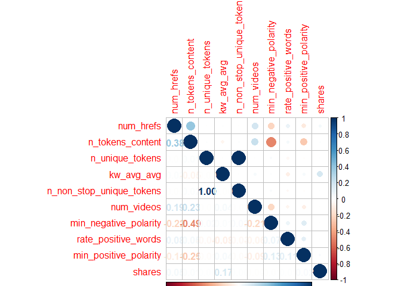
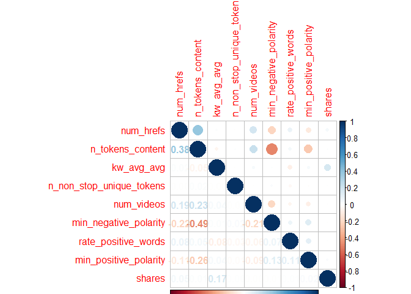
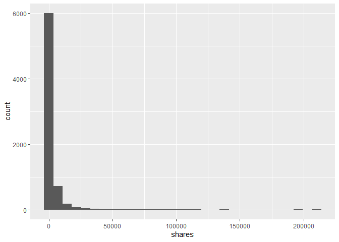
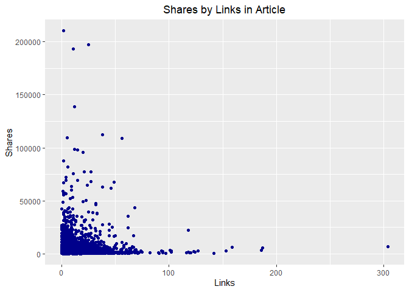
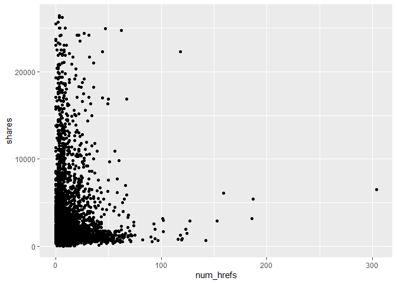
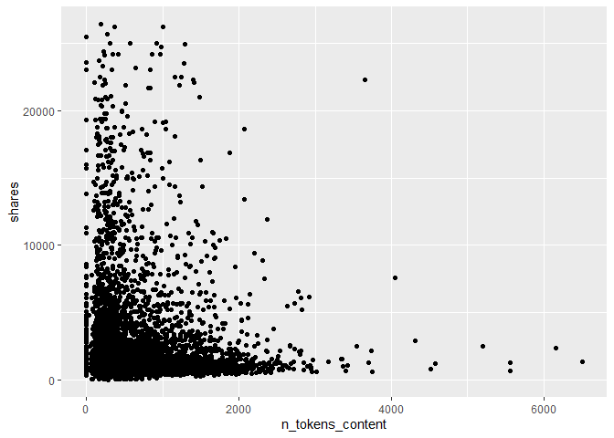
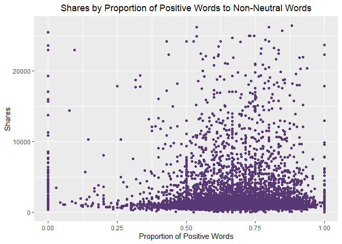

project-3
================
Justin Feathers
2022-11-01

-   <a href="#introduction" id="toc-introduction">Introduction</a>
-   <a href="#data" id="toc-data">Data</a>
-   <a href="#summarizations" id="toc-summarizations">Summarizations</a>
    -   <a href="#correlation" id="toc-correlation">Correlation</a>
    -   <a href="#plots" id="toc-plots">Plots</a>
-   <a href="#modeling" id="toc-modeling">Modeling</a>
    -   <a href="#multiple-linear-regression"
        id="toc-multiple-linear-regression">Multiple Linear Regression</a>
    -   <a href="#random-forest" id="toc-random-forest">Random Forest</a>
-   <a href="#comparison" id="toc-comparison">Comparison</a>

# Introduction

The dataset we’ll be exploring is a collection of online news articles
published by Mashable in a period of two years. By analyzing a subset of
the variables from the dataset, we hope to predict the response
variable, `shares`. Using correlation plots, I have decided to use
`num_hrefs` (number of links in the article), `n_tokens_content` (number
of words in the article), `kw_avg_avg` (mean shares for the average
number of keywords), `n_non_stop_unique_tokens` (the rate of unique
non-stop words in the content), `num_videos` (the number of videos),
`min_negative_polarity` (minimum polarity of negative words),
`rate_positive_words` (rate of positive words among non-neutral tokens),
and `min_positive_polarity` (minimum polarity of positive words) as our
predictive variables. I will go into more detail with the variable
selection process later.

We will explore these variables through a number of summary statistics
and plots and finally use multiple linear regression and random forest
models to make predictions for the `shares` variable.

# Data

The first step in any analysis is to call the required packages and read
in the dataset. Here, we use the `get` function to tell R to use the
character string as a variable object – in this case, the appropriate
`params` value which corresponds to one of six data channels in the
dataset that we will use to subset the rows. By using a logical
statement we are able to choose only the rows corresponding to our news
channel. Because `url` and `timedelta` are not predictive variables,
they have been dropped from the dataset.

``` r
library(tidyverse)
library(ggplot2)
library(lattice)
library(corrplot)
library(caret)
library(shiny)
newsData <- read_csv(file = "./OnlineNewsPopularity.csv")
data <- newsData %>% 
            filter(get(paste0("data_channel_is_", params$channel)) == 1) %>%
              select(-url, -timedelta)
```

# Summarizations

Now that we have the data read in, what do we do with it? We should
perform an exploratory data analysis to get an idea of what we’re
working with and give some summarizations in the form of tables and
plots.

## Correlation

A good way to start is by checking how strongly all variables are
correlated to the response variable of interest. This is the beginning
of the variable selection process. Since we are interested in predicting
`shares`, I created a correlation matrix using the `cor` function and
sorted the absolute values of the output to get a convenient tibble of
descending correlation values; this was originally done using the `tech`
data channel to set the ground work. I decided to choose the 9 variables
with the highest correlation with `shares`.

``` r
dataCor <- cor(data$shares, data) %>%
        as.tibble() %>%
        abs() %>%
        sort(decreasing = TRUE)
dataCor
```

<div data-pagedtable="false">

<script data-pagedtable-source type="application/json">
{"columns":[{"label":["shares"],"name":[1],"type":["dbl"],"align":["right"]},{"label":["kw_avg_avg"],"name":[2],"type":["dbl"],"align":["right"]},{"label":["kw_max_avg"],"name":[3],"type":["dbl"],"align":["right"]},{"label":["kw_max_min"],"name":[4],"type":["dbl"],"align":["right"]},{"label":["kw_avg_min"],"name":[5],"type":["dbl"],"align":["right"]},{"label":["self_reference_avg_sharess"],"name":[6],"type":["dbl"],"align":["right"]},{"label":["self_reference_min_shares"],"name":[7],"type":["dbl"],"align":["right"]},{"label":["self_reference_max_shares"],"name":[8],"type":["dbl"],"align":["right"]},{"label":["num_hrefs"],"name":[9],"type":["dbl"],"align":["right"]},{"label":["num_keywords"],"name":[10],"type":["dbl"],"align":["right"]},{"label":["num_imgs"],"name":[11],"type":["dbl"],"align":["right"]},{"label":["global_subjectivity"],"name":[12],"type":["dbl"],"align":["right"]},{"label":["kw_avg_max"],"name":[13],"type":["dbl"],"align":["right"]},{"label":["LDA_03"],"name":[14],"type":["dbl"],"align":["right"]},{"label":["is_weekend"],"name":[15],"type":["dbl"],"align":["right"]},{"label":["LDA_02"],"name":[16],"type":["dbl"],"align":["right"]},{"label":["weekday_is_sunday"],"name":[17],"type":["dbl"],"align":["right"]},{"label":["LDA_00"],"name":[18],"type":["dbl"],"align":["right"]},{"label":["kw_min_avg"],"name":[19],"type":["dbl"],"align":["right"]},{"label":["title_subjectivity"],"name":[20],"type":["dbl"],"align":["right"]},{"label":["abs_title_sentiment_polarity"],"name":[21],"type":["dbl"],"align":["right"]},{"label":["avg_positive_polarity"],"name":[22],"type":["dbl"],"align":["right"]},{"label":["min_positive_polarity"],"name":[23],"type":["dbl"],"align":["right"]},{"label":["global_sentiment_polarity"],"name":[24],"type":["dbl"],"align":["right"]},{"label":["global_rate_positive_words"],"name":[25],"type":["dbl"],"align":["right"]},{"label":["LDA_04"],"name":[26],"type":["dbl"],"align":["right"]},{"label":["weekday_is_tuesday"],"name":[27],"type":["dbl"],"align":["right"]},{"label":["global_rate_negative_words"],"name":[28],"type":["dbl"],"align":["right"]},{"label":["weekday_is_saturday"],"name":[29],"type":["dbl"],"align":["right"]},{"label":["kw_max_max"],"name":[30],"type":["dbl"],"align":["right"]},{"label":["max_negative_polarity"],"name":[31],"type":["dbl"],"align":["right"]},{"label":["num_self_hrefs"],"name":[32],"type":["dbl"],"align":["right"]},{"label":["n_tokens_content"],"name":[33],"type":["dbl"],"align":["right"]},{"label":["avg_negative_polarity"],"name":[34],"type":["dbl"],"align":["right"]},{"label":["average_token_length"],"name":[35],"type":["dbl"],"align":["right"]},{"label":["LDA_01"],"name":[36],"type":["dbl"],"align":["right"]},{"label":["n_tokens_title"],"name":[37],"type":["dbl"],"align":["right"]},{"label":["weekday_is_wednesday"],"name":[38],"type":["dbl"],"align":["right"]},{"label":["max_positive_polarity"],"name":[39],"type":["dbl"],"align":["right"]},{"label":["rate_negative_words"],"name":[40],"type":["dbl"],"align":["right"]},{"label":["min_negative_polarity"],"name":[41],"type":["dbl"],"align":["right"]},{"label":["kw_min_max"],"name":[42],"type":["dbl"],"align":["right"]},{"label":["rate_positive_words"],"name":[43],"type":["dbl"],"align":["right"]},{"label":["weekday_is_thursday"],"name":[44],"type":["dbl"],"align":["right"]},{"label":["n_unique_tokens"],"name":[45],"type":["dbl"],"align":["right"]},{"label":["n_non_stop_words"],"name":[46],"type":["dbl"],"align":["right"]},{"label":["n_non_stop_unique_tokens"],"name":[47],"type":["dbl"],"align":["right"]},{"label":["abs_title_subjectivity"],"name":[48],"type":["dbl"],"align":["right"]},{"label":["kw_min_min"],"name":[49],"type":["dbl"],"align":["right"]},{"label":["title_sentiment_polarity"],"name":[50],"type":["dbl"],"align":["right"]},{"label":["weekday_is_monday"],"name":[51],"type":["dbl"],"align":["right"]},{"label":["weekday_is_friday"],"name":[52],"type":["dbl"],"align":["right"]},{"label":["num_videos"],"name":[53],"type":["dbl"],"align":["right"]}],"data":[{"1":"1","2":"0.1742764","3":"0.1596356","4":"0.1398467","5":"0.1198875","6":"0.09533648","7":"0.07864837","8":"0.0742809","9":"0.04676477","10":"0.0397448","11":"0.03809298","12":"0.03751081","13":"0.03649163","14":"0.03394801","15":"0.03326525","16":"0.03081855","17":"0.03066592","18":"0.03064968","19":"0.02827869","20":"0.02520492","21":"0.02513925","22":"0.0240712","23":"0.02379888","24":"0.01954282","25":"0.01844167","26":"0.0170663","27":"0.0157599","28":"0.01360618","29":"0.01353825","30":"0.01352521","31":"0.01203021","32":"0.01146973","33":"0.01122183","34":"0.01057653","35":"0.009991654","36":"0.009480464","37":"0.009065995","38":"0.006990723","39":"0.006940211","40":"0.006778685","41":"0.005900553","42":"0.005658058","43":"0.005400506","44":"0.005164032","45":"0.004551485","46":"0.004438222","47":"0.004268375","48":"0.003476565","49":"0.003088106","50":"0.002798214","51":"0.002450865","52":"0.001549303","53":"0.0005863698"}],"options":{"columns":{"min":{},"max":[10]},"rows":{"min":[10],"max":[10]},"pages":{}}}
  </script>

</div>

``` r
data <- data %>% 
            select(num_hrefs, n_tokens_content, n_unique_tokens, kw_avg_avg,
                   n_non_stop_unique_tokens, num_videos, min_negative_polarity,
                   rate_positive_words, min_positive_polarity, shares)
```

From here, we can look at a correlation plot of the chosen variables to
see if multicollinearity exists between any of them. Using `corrplot`,
we can check the relationships (correlations) between the chosen
variables. Though subjective in nature, a general rule of thumb is that
any correlation between variables (not involving the response) greater
than 0.70 or less than -0.70 is considered a problematic level of
multicollinearity. In the original assessment, `n_unique_tokens` had a
high correlation with 2 different variables, so it was dropped from the
dataset.

``` r
correlation <- cor(data)
corrplot(correlation, type = "upper", tl.pos = "lt")
corrplot(correlation, type = "lower", method = "number",
         add = TRUE, diag = FALSE, tl.pos = "n")
```

<!-- -->

``` r
data <- data %>%
            select(-n_unique_tokens)

correlation <- cor(data)
corrplot(correlation, type = "upper", tl.pos = "lt")
corrplot(correlation, type = "lower", method = "number",
         add = TRUE, diag = FALSE, tl.pos = "n")
```

<!-- -->

Next, we should look at some summary data with `summary()` to get a feel
for the ranges of the predictors and response.

``` r
summary <- summary(data)
summary  
```

    ##    num_hrefs      n_tokens_content   kw_avg_avg    n_non_stop_unique_tokens   num_videos     min_negative_polarity
    ##  Min.   :  0.00   Min.   :   0.0   Min.   :    0   Min.   :  0.0000         Min.   : 0.000   Min.   :-1.0000      
    ##  1st Qu.:  4.00   1st Qu.: 255.0   1st Qu.: 2551   1st Qu.:  0.6234         1st Qu.: 0.000   1st Qu.:-0.8000      
    ##  Median :  7.00   Median : 433.0   Median : 2967   Median :  0.6917         Median : 1.000   Median :-0.6000      
    ##  Mean   : 10.69   Mean   : 607.5   Mean   : 3156   Mean   :  0.7632         Mean   : 2.546   Mean   :-0.5877      
    ##  3rd Qu.: 13.00   3rd Qu.: 805.0   3rd Qu.: 3553   3rd Qu.:  0.7597         3rd Qu.: 1.000   3rd Qu.:-0.4000      
    ##  Max.   :304.00   Max.   :6505.0   Max.   :36023   Max.   :650.0000         Max.   :74.000   Max.   : 0.0000      
    ##  rate_positive_words min_positive_polarity     shares      
    ##  Min.   :0.0000      Min.   :0.00000       Min.   :    47  
    ##  1st Qu.:0.5789      1st Qu.:0.05000       1st Qu.:   833  
    ##  Median :0.6875      Median :0.10000       Median :  1200  
    ##  Mean   :0.6663      Mean   :0.09351       Mean   :  2970  
    ##  3rd Qu.:0.7843      3rd Qu.:0.10000       3rd Qu.:  2100  
    ##  Max.   :1.0000      Max.   :1.00000       Max.   :210300

``` r
mean <- mean(data$shares)
paste0("The mean of shares is ", summary[4, 9])
```

    ## [1] "The mean of shares is Mean   :  2970  "

``` r
paste0("The 3rd Quartile of shares is ", summary[5, 9])
```

    ## [1] "The 3rd Quartile of shares is 3rd Qu.:  2100  "

``` r
sd <- sd(data$shares)
paste0("The standard deviation of shares is ", sd)
```

    ## [1] "The standard deviation of shares is 7858.13392044205"

``` r
paste0("The maximum value of shares is ", summary[6, 9])
```

    ## [1] "The maximum value of shares is Max.   :210300  "

``` r
interval <- 3*sd(data$shares) + mean(data$shares)
g <- ggplot(data, aes(x = shares))
g + geom_histogram()
```

<!-- -->

We can see from the summary statistics and histogram that `shares` has a
very large max value, but a small mean, q3, and standard deviation
comparatively. This indicates that the distribution is strongly skewed
left. We can fix this by temporarily removing outliers to make data
visualization more meaningful. Using the mean and standard deviation for
`shares`, we can calculate an interval that gives us 3 standard
deviations above the mean, which means we will encompass 99.7% of the
data while removing outliers. Because we can’t have negative shares, we
will have values between 0 and 2.6544889^{4}.

## Plots

First, we’ll take a look at a plot without the adjustment for
comparison’s sake.

``` r
g <- ggplot(data, aes(y = shares))
g + geom_point(aes(x = num_hrefs), color = "darkblue") +
    labs(x = "Links", 
         y = "Shares",
         title = "Shares by Links in Article") +
         theme(plot.title = element_text(hjust = 0.5))
```

<!-- -->

``` r
temp <- data %>%
          filter(shares < interval)
g <- ggplot(temp, aes(y = shares))
g + geom_point(aes(x = num_hrefs), color = "darkblue") +
    labs(x = "Links",
         y = "Shares",
         title = "Shares by Links in Article") +
         theme(plot.title = element_text(hjust = 0.5))
```

<!-- -->

Clearly the adjustment does, indeed, make it easier to observe trends in
the data. Now we can inspect some scatter plots with our improved
`shares` variable.  
The above is a scatter plot of `num_hrefs` by `shares`. A positive trend
would indicate that shares should increase as the number of links in the
article increases. If we observe a negative trend, the number of shares
should decrease as the number of links increases.

Next is a scatter plot of `n_tokens_content` by `shares`. A positive
trend would indicate that shares should increase as the number of words
in the article increases; likewise, the number of shares should decrease
as word count increases if we observe a negative trend.

``` r
g + geom_point(aes(x = n_tokens_content), color = "#355E3B") +
    labs(x = "Words",
         y = "Shares",
         title = "Shares by Words in Article") +
         theme(plot.title = element_text(hjust = 0.5))
```

<!-- -->

And finally, we have a scatter plot of `rate_positive_words` by
`shares`. Again, a positive trend would indicate that we should observe
an increase in shares as as the proportion of positive words to
non-neutral words increases while a negative trend would indicate a
decrease in shares as the proportion of positive words to non-neutral
words increases.

``` r
g + geom_point(aes(x = rate_positive_words), color = "#593876") +
    labs(x = "Proportion of Positive Words",
         y = "Shares",
         title = "Shares by Proportion of Positive Words to Non-Neutral Words") +
         theme(plot.title = element_text(hjust = 0.5))
```

<!-- -->

# Modeling

Now that we have some rudimentary understanding of the data, we can
explore predictions using different models. The first step in this
process is to split the data into a training and test set. We will use
the `createDataPartition` function to create an index on which to split
the data, using 70% for the training set and the remaining 30% for the
test set.

``` r
set.seed(250)
index <- createDataPartition(data$shares, p = 0.70, list = FALSE)
train <- data[index, ]
test <- data[-index, ]
```

## Multiple Linear Regression

A linear regression model attempts to use one or more predictor
variables to explain (or predict) a single response variable. In this
particular case, we will fit a multiple linear regression model, which
means we will use a linear combination of more than one variable to
explain our response variable, `shares`.

Using the `train` function, we will train the data using the `train`
object we created, making sure to preprocess the data by centering and
scaling it. Notice for a linear regression model, we use method `lm`; we
are also specifying the `trControl` option to run cross-validation with
five folds.

We can use the `predict` function to utilize the trained data for making
predictions on the test set.

``` r
mlrFit <- train(shares ~ ., data = train,
                preProcess = c("center", "scale"),
                method = "lm",
                trControl = trainControl(method = "cv", number = 5))
paste0("The results for the model fit on the training set are:")  
```

    ## [1] "The results for the model fit on the training set are:"

``` r
mlrFit$results
```

<div data-pagedtable="false">

<script data-pagedtable-source type="application/json">
{"columns":[{"label":[""],"name":["_rn_"],"type":[""],"align":["left"]},{"label":["intercept"],"name":[1],"type":["lgl"],"align":["right"]},{"label":["RMSE"],"name":[2],"type":["dbl"],"align":["right"]},{"label":["Rsquared"],"name":[3],"type":["dbl"],"align":["right"]},{"label":["MAE"],"name":[4],"type":["dbl"],"align":["right"]},{"label":["RMSESD"],"name":[5],"type":["dbl"],"align":["right"]},{"label":["RsquaredSD"],"name":[6],"type":["dbl"],"align":["right"]},{"label":["MAESD"],"name":[7],"type":["dbl"],"align":["right"]}],"data":[{"1":"TRUE","2":"8757.112","3":"0.06068752","4":"3088.291","5":"1790.28","6":"0.1064295","7":"79.5968","_rn_":"1"}],"options":{"columns":{"min":{},"max":[10]},"rows":{"min":[10],"max":[10]},"pages":{}}}
  </script>

</div>

``` r
mlrPredict <- predict(mlrFit, newdata = test)
mlrPredictResults <- postResample(mlrPredict, test$shares)
paste0("The results for the model fit on the test set are:")
```

    ## [1] "The results for the model fit on the test set are:"

``` r
mlrPredictResults
```

    ##         RMSE     Rsquared          MAE 
    ## 7.970536e+03 6.112606e-03 2.976325e+03

``` r
mlrRsquare <- mlrPredictResults[2]
```

`mlrFit` gives us an R<sup>2</sup> value of **0.0606875 for the trained
data**, while `mlrRsquare` gives us an R<sup>2</sup> value of
**0.0061126 for the test set**. If the R<sup>2</sup> value for the
training set is low, the model is underfitting the data and more
exploration needs to be done in order to find a better model, better
predictor variables, or both.

If the training and test set R<sup>2</sup> values are similar, then we
can say the model generalizes well. If the training set R<sup>2</sup> is
much higher than the test set R<sup>2</sup>, then we can say the model
is overfitting the data, meaning the model does not generalize well to
data outside the training set.

## Random Forest

Now we will fit a more robust model – a random forest. This model is one
of many tree-based methods that splits up the predictor space into
regions with different predictions for each region. A random forest
utilizes a method known as “bootstrap aggregation”. This process takes a
single sample and then takes repeated samples of size n with replacement
(where n = the total number of observations in the original sample) to
create a distribution of bootstrapped samples which greatly reduces
variance. What I have described so far is known as a “bagged tree”
method; a random forest takes the idea of a bagged tree one step further
by also taking a random subset of predictor variables for each bootstrap
sample. If a very strong predictor exists, every bootstrap sample will
likely use it for the first split. This is problematic because it will
cause the trees produced to have more strongly correlated predictions
which, in turn, diminishes the variance reduction from the bootstrap
aggregation process described earlier. Choosing a random subset of
predictors mitigates this problem by greatly increasing the likelihood
that any given tree does not select the dominating predictor variable.

Now that we have an understanding of how the method works, we can set up
a random forest model for our data. Just like the linear regression
model, we can use the `train` function, but this time with method `rf`.
Although preprocessing is not necessary for tree-based methods, I still
like to include it in my models as a best practice, lest I forget to use
it when it is necessary. The `tuneGrid` option is where we can tell the
model how many predictor variables to grab per bootstrap sample. The
default is (number of predictors)/3 for regression, but I still like to
do this as best practice again. The `trainControl` function within the
`trControl` option is how we set up options like the cross-validation we
will use here. Finally, as with the multiple linear regression above, we
can use the trained data to make predictions on the test set.

``` r
forest <- train(shares ~ ., data = train,
                method = "rf",
                preProcess = c("center", "scale"),
                tuneGrid = data.frame(mtry = ncol(train)/3),
                trControl = trainControl(method = "cv", number = 5))
paste0("The results for the model fit on the training set are:")  
```

    ## [1] "The results for the model fit on the training set are:"

``` r
forest$results
```

<div data-pagedtable="false">

<script data-pagedtable-source type="application/json">
{"columns":[{"label":[""],"name":["_rn_"],"type":[""],"align":["left"]},{"label":["mtry"],"name":[1],"type":["dbl"],"align":["right"]},{"label":["RMSE"],"name":[2],"type":["dbl"],"align":["right"]},{"label":["Rsquared"],"name":[3],"type":["dbl"],"align":["right"]},{"label":["MAE"],"name":[4],"type":["dbl"],"align":["right"]},{"label":["RMSESD"],"name":[5],"type":["dbl"],"align":["right"]},{"label":["RsquaredSD"],"name":[6],"type":["dbl"],"align":["right"]},{"label":["MAESD"],"name":[7],"type":["dbl"],"align":["right"]}],"data":[{"1":"3","2":"7878.287","3":"0.01240766","4":"3109.551","5":"1369.694","6":"0.007102366","7":"179.5894","_rn_":"1"}],"options":{"columns":{"min":{},"max":[10]},"rows":{"min":[10],"max":[10]},"pages":{}}}
  </script>

</div>

``` r
forestPredict <- predict(forest, newdata = test)
forestPredictResults <- postResample(forestPredict, test$shares)
paste0("The results for the model fit on the test set are:")
```

    ## [1] "The results for the model fit on the test set are:"

``` r
forestPredictResults
```

    ##         RMSE     Rsquared          MAE 
    ## 8.092130e+03 1.228135e-02 3.043683e+03

``` r
forestRsquare <- forestPredictResults[2]
```

`forest` gives us an R<sup>2</sup> value of **0.0124077 for the trained
data**, while `forestRsquare` gives us an R<sup>2</sup> value of
**0.0122814 for the test set**.

# Comparison

To compare the models, we will use a simple comparison of R<sup>2</sup>
and choose the one with the highest value. We will use this method since
R<sup>2</sup> can be interpreted as how much of the variance in the data
can be explained by the model, i.e., how well the model fits.

``` r
if (mlrRsquare > forestRsquare) {
  paste0("Multiple linear regression is the preferred model for data channel = ", params$channel)
} else {
  paste0("Random forest is the preferred model for data channel = ", params$channel)
} 
```

    ## [1] "Random forest is the preferred model for data channel = entertainment"
