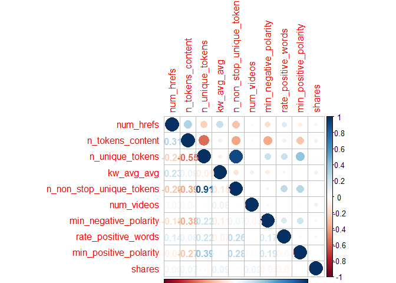
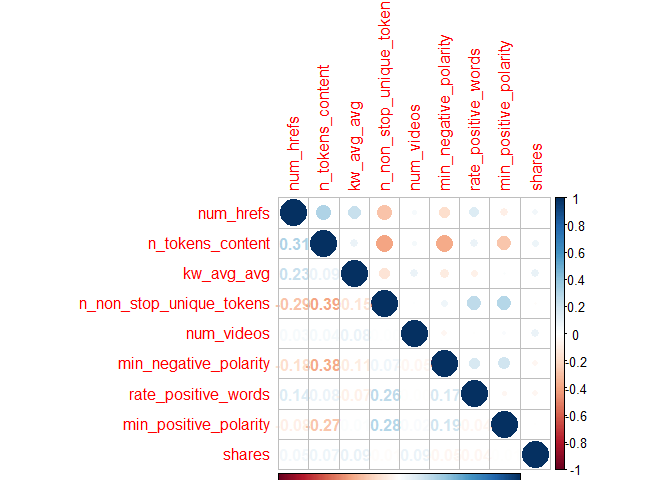
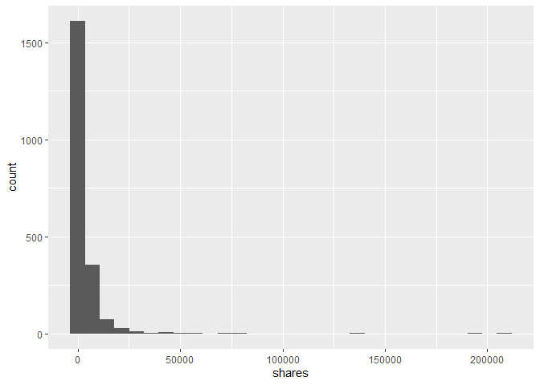
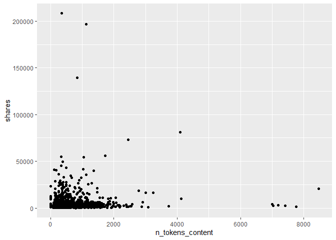
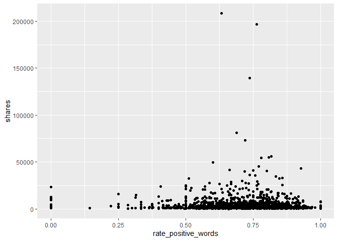

project-3
================
Justin Feathers
2022-11-01

-   <a href="#introduction" id="toc-introduction">Introduction</a>
-   <a href="#data" id="toc-data">Data</a>
-   <a href="#summarizations" id="toc-summarizations">Summarizations</a>
-   <a href="#modeling" id="toc-modeling">Modeling</a>
    -   <a href="#multiple-linear-regression"
        id="toc-multiple-linear-regression">Multiple Linear Regression</a>
    -   <a href="#random-forest" id="toc-random-forest">Random Forest</a>
-   <a href="#comparison" id="toc-comparison">Comparison</a>

# Introduction

A good way of starting is by checking how strongly all variables are
correlated to the response variable of interest. I created a correlation
matrix using the `cor` function and sorted the absolute values of the
output to get a convenient tibble of descending correlation values.

From here, we can look at a correlation plot of the chosen variables to
see if multicollinearity exists between any of the variables. Using
`corrplot`, we can see that the variables `n_unique_tokens` and
`n_tokens_content` have a strong negative correlation of -0.73. There is
an extremely strong positive correlation of 0.93 between
`n_unique_tokens` and `n_non_stop_unique_tokens` – we will try dropping
`n_unique_tokens` from the dataset and reassessing. We can see in the
new `corrplot` that multicollinearity has been minimized as desired.

Describes the data and variables we want to use. Target is `shares`

``` r
library(tidyverse)
library(corrplot)
library(caret)
```

# Data

``` r
newsData <- read_csv(file = "./OnlineNewsPopularity.csv")
data <- newsData %>% 
            filter(get(paste0("data_channel_is_", params$channel)) == 1) %>%
              select(-url, -timedelta)
```

# Summarizations

We can analyze a few of the variables by plotting them against `shares`.
If we create a scatter plot of `num_imgs` by `shares`, we can see an
outlier when `num_imgs` = 1. Let’s remove that.

``` r
dataCor <- cor(data$shares, data) %>%
        as.tibble() %>%
        abs() %>%
        sort(decreasing = TRUE)
dataCor
```

<div data-pagedtable="false">

<script data-pagedtable-source type="application/json">
{"columns":[{"label":["shares"],"name":[1],"type":["dbl"],"align":["right"]},{"label":["kw_avg_avg"],"name":[2],"type":["dbl"],"align":["right"]},{"label":["num_videos"],"name":[3],"type":["dbl"],"align":["right"]},{"label":["n_tokens_content"],"name":[4],"type":["dbl"],"align":["right"]},{"label":["self_reference_min_shares"],"name":[5],"type":["dbl"],"align":["right"]},{"label":["LDA_03"],"name":[6],"type":["dbl"],"align":["right"]},{"label":["kw_max_avg"],"name":[7],"type":["dbl"],"align":["right"]},{"label":["num_hrefs"],"name":[8],"type":["dbl"],"align":["right"]},{"label":["num_imgs"],"name":[9],"type":["dbl"],"align":["right"]},{"label":["min_negative_polarity"],"name":[10],"type":["dbl"],"align":["right"]},{"label":["self_reference_avg_sharess"],"name":[11],"type":["dbl"],"align":["right"]},{"label":["rate_positive_words"],"name":[12],"type":["dbl"],"align":["right"]},{"label":["LDA_04"],"name":[13],"type":["dbl"],"align":["right"]},{"label":["LDA_02"],"name":[14],"type":["dbl"],"align":["right"]},{"label":["kw_max_max"],"name":[15],"type":["dbl"],"align":["right"]},{"label":["kw_min_min"],"name":[16],"type":["dbl"],"align":["right"]},{"label":["weekday_is_monday"],"name":[17],"type":["dbl"],"align":["right"]},{"label":["kw_avg_max"],"name":[18],"type":["dbl"],"align":["right"]},{"label":["abs_title_subjectivity"],"name":[19],"type":["dbl"],"align":["right"]},{"label":["average_token_length"],"name":[20],"type":["dbl"],"align":["right"]},{"label":["weekday_is_friday"],"name":[21],"type":["dbl"],"align":["right"]},{"label":["avg_negative_polarity"],"name":[22],"type":["dbl"],"align":["right"]},{"label":["global_rate_negative_words"],"name":[23],"type":["dbl"],"align":["right"]},{"label":["n_unique_tokens"],"name":[24],"type":["dbl"],"align":["right"]},{"label":["n_non_stop_words"],"name":[25],"type":["dbl"],"align":["right"]},{"label":["weekday_is_wednesday"],"name":[26],"type":["dbl"],"align":["right"]},{"label":["LDA_01"],"name":[27],"type":["dbl"],"align":["right"]},{"label":["rate_negative_words"],"name":[28],"type":["dbl"],"align":["right"]},{"label":["weekday_is_tuesday"],"name":[29],"type":["dbl"],"align":["right"]},{"label":["global_sentiment_polarity"],"name":[30],"type":["dbl"],"align":["right"]},{"label":["kw_min_max"],"name":[31],"type":["dbl"],"align":["right"]},{"label":["num_keywords"],"name":[32],"type":["dbl"],"align":["right"]},{"label":["self_reference_max_shares"],"name":[33],"type":["dbl"],"align":["right"]},{"label":["kw_min_avg"],"name":[34],"type":["dbl"],"align":["right"]},{"label":["LDA_00"],"name":[35],"type":["dbl"],"align":["right"]},{"label":["global_subjectivity"],"name":[36],"type":["dbl"],"align":["right"]},{"label":["num_self_hrefs"],"name":[37],"type":["dbl"],"align":["right"]},{"label":["n_non_stop_unique_tokens"],"name":[38],"type":["dbl"],"align":["right"]},{"label":["kw_max_min"],"name":[39],"type":["dbl"],"align":["right"]},{"label":["weekday_is_saturday"],"name":[40],"type":["dbl"],"align":["right"]},{"label":["is_weekend"],"name":[41],"type":["dbl"],"align":["right"]},{"label":["max_negative_polarity"],"name":[42],"type":["dbl"],"align":["right"]},{"label":["kw_avg_min"],"name":[43],"type":["dbl"],"align":["right"]},{"label":["weekday_is_thursday"],"name":[44],"type":["dbl"],"align":["right"]},{"label":["avg_positive_polarity"],"name":[45],"type":["dbl"],"align":["right"]},{"label":["min_positive_polarity"],"name":[46],"type":["dbl"],"align":["right"]},{"label":["global_rate_positive_words"],"name":[47],"type":["dbl"],"align":["right"]},{"label":["title_subjectivity"],"name":[48],"type":["dbl"],"align":["right"]},{"label":["title_sentiment_polarity"],"name":[49],"type":["dbl"],"align":["right"]},{"label":["n_tokens_title"],"name":[50],"type":["dbl"],"align":["right"]},{"label":["weekday_is_sunday"],"name":[51],"type":["dbl"],"align":["right"]},{"label":["max_positive_polarity"],"name":[52],"type":["dbl"],"align":["right"]},{"label":["abs_title_sentiment_polarity"],"name":[53],"type":["dbl"],"align":["right"]}],"data":[{"1":"1","2":"0.09151899","3":"0.08831106","4":"0.07302425","5":"0.07239815","6":"0.06804324","7":"0.05361193","8":"0.05358639","9":"0.0512013","10":"0.04756143","11":"0.04240444","12":"0.04158548","13":"0.04000588","14":"0.03679955","15":"0.03676879","16":"0.03595713","17":"0.03180005","18":"0.0313892","19":"0.031166","20":"0.03056319","21":"0.03046185","22":"0.03042206","23":"0.02968718","24":"0.02967712","25":"0.02785583","26":"0.02728382","27":"0.02667249","28":"0.0251372","29":"0.0230349","30":"0.02230472","31":"0.02066715","32":"0.0196917","33":"0.0188409","34":"0.01826119","35":"0.01825793","36":"0.01773988","37":"0.01643292","38":"0.01389977","39":"0.01340154","40":"0.0131925","41":"0.01265463","42":"0.01234227","43":"0.01021514","44":"0.00928353","45":"0.009062109","46":"0.006805796","47":"0.005395787","48":"0.004971199","49":"0.004779263","50":"0.00408709","51":"0.004063292","52":"0.003560046","53":"0.0007176881"}],"options":{"columns":{"min":{},"max":[10]},"rows":{"min":[10],"max":[10]},"pages":{}}}
  </script>

</div>

``` r
data <- data %>% 
            select(num_hrefs, n_tokens_content, n_unique_tokens, kw_avg_avg,
                   n_non_stop_unique_tokens, num_videos, min_negative_polarity,
                   rate_positive_words, min_positive_polarity, shares)

correlation <- cor(data)
corrplot(correlation, type = "upper", tl.pos = "lt")
corrplot(correlation, type = "lower", method = "number",
         add = TRUE, diag = FALSE, tl.pos = "n")
```

<!-- -->

``` r
data <- data %>%
            select(-n_unique_tokens)

correlation <- cor(data)
corrplot(correlation, type = "upper", tl.pos = "lt")
corrplot(correlation, type = "lower", method = "number",
         add = TRUE, diag = FALSE, tl.pos = "n")
```

<!-- -->

We can see the outlier is a single point. We can find the value by using
a `summary` statement. After filtering out the outlier, we can see the
scatter plot looks much more reasonable. Based on this plot, it looks
like articles with 0 or 1 images tend to get the most shares with a
quadratic decline until hitting the local minimum at 5 images where it
changes to a positive upswing until 11 images. It looks as though
`shares` continues on a negative linear trend after that. Inspecting the
plot for `shares` vs. `n_tokens_content` seems to suggest shares tend to
decrease after articles go beyond 250-500 words. Next, the plot of
`shares` vs. `rate_positive_words` suggests that articles are far more
likely to be shared as the rate of positive words increases. Finally, we
can see quartiles and means for the variables using the `summary`
function and standard deviations with the `sd` function.

``` r
summary(data$shares)
```

    ##    Min. 1st Qu.  Median    Mean 3rd Qu.    Max. 
    ##      28    1100    1700    3682    3250  208300

``` r
noOutlier <- data %>%
             filter(shares != 663600)

g <- ggplot(noOutlier, aes(y = shares))
g + geom_point(aes(x = num_hrefs))
```

<!-- -->

``` r
g + geom_point(aes(x = n_tokens_content))
```

<!-- -->

``` r
g + geom_point(aes(x = rate_positive_words))
```

<!-- -->

``` r
summary(data)
```

    ##    num_hrefs      n_tokens_content   kw_avg_avg    n_non_stop_unique_tokens   num_videos     min_negative_polarity
    ##  Min.   :  0.00   Min.   :   0.0   Min.   :    0   Min.   :0.0000           Min.   : 0.000   Min.   :-1.0000      
    ##  1st Qu.:  6.00   1st Qu.: 308.5   1st Qu.: 2644   1st Qu.:0.6275           1st Qu.: 0.000   1st Qu.:-0.7000      
    ##  Median : 10.00   Median : 502.0   Median : 3239   Median :0.6841           Median : 0.000   Median :-0.5000      
    ##  Mean   : 13.42   Mean   : 621.3   Mean   : 3419   Mean   :0.6834           Mean   : 0.475   Mean   :-0.5513      
    ##  3rd Qu.: 18.00   3rd Qu.: 795.0   3rd Qu.: 3945   3rd Qu.:0.7524           3rd Qu.: 0.000   3rd Qu.:-0.4000      
    ##  Max.   :145.00   Max.   :8474.0   Max.   :20378   Max.   :1.0000           Max.   :50.000   Max.   : 0.0000      
    ##  rate_positive_words min_positive_polarity     shares      
    ##  Min.   :0.0000      Min.   :0.00000       Min.   :    28  
    ##  1st Qu.:0.6625      1st Qu.:0.05000       1st Qu.:  1100  
    ##  Median :0.7377      Median :0.10000       Median :  1700  
    ##  Mean   :0.7226      Mean   :0.09482       Mean   :  3682  
    ##  3rd Qu.:0.8125      3rd Qu.:0.10000       3rd Qu.:  3250  
    ##  Max.   :1.0000      Max.   :0.50000       Max.   :208300

``` r
data %>%
  sapply(sd)
```

    ##                num_hrefs         n_tokens_content               kw_avg_avg n_non_stop_unique_tokens 
    ##             1.153056e+01             5.660532e+02             1.364968e+03             1.160655e-01 
    ##               num_videos    min_negative_polarity      rate_positive_words    min_positive_polarity 
    ##             1.919922e+00             2.705361e-01             1.458903e-01             6.542755e-02 
    ##                   shares 
    ##             8.885017e+03

# Modeling

``` r
set.seed(250)
index <- createDataPartition(data$shares, p = 0.70, list = FALSE)
train <- data[index, ]
test <- data[-index, ]
```

## Multiple Linear Regression

Fitting a multiple regression model on all variables in the `data`
dataset, we can see from the `summary` function that this model is not a
very good fit with an adjusted R^2 value of 0.01 – this means only 1% of
the variance in the data is explained by the model. We need to explore
better options.

``` r
mlrFit <- train(shares ~ ., data = train,
                preProcess = c("center", "scale"),
                method = "lm",
                trControl = trainControl(method = "cv", number = 5))
mlrPredict <- predict(mlrFit, newdata = test)
temp <- postResample(mlrPredict, test$shares)
mlrRsquare <- temp[2]
mlrRsquare
```

    ##     Rsquared 
    ## 0.0003125642

## Random Forest

``` r
forest <- train(shares ~ ., data = train,
                method = "rf",
                preProcess = c("center", "scale"),
                tuneGrid = data.frame(mtry = ncol(train)/3),
                trControl = trainControl(method = "cv", number = 5))
forestPredict <- predict(forest, newdata = test)
temp <- postResample(forestPredict, test$shares)
forestRsquare <- temp[2]
forestRsquare
```

    ##   Rsquared 
    ## 0.01114782

# Comparison

To compare the models, we will use a simple comparison of R^2 and choose
the one with the highest value. We will use this method since R^2 can be
interpreted as how much of the variance in the data can be explained by
the model, i.e., how well the model fits.

``` r
if (mlrRsquare > forestRsquare) {
  paste0("Multiple linear regression is the preferred model for data channel = ", params$channel)
} else {
  paste0("Random forest is the preferred model for data channel = ", params$channel)
} 
```

    ## [1] "Random forest is the preferred model for data channel = lifestyle"
