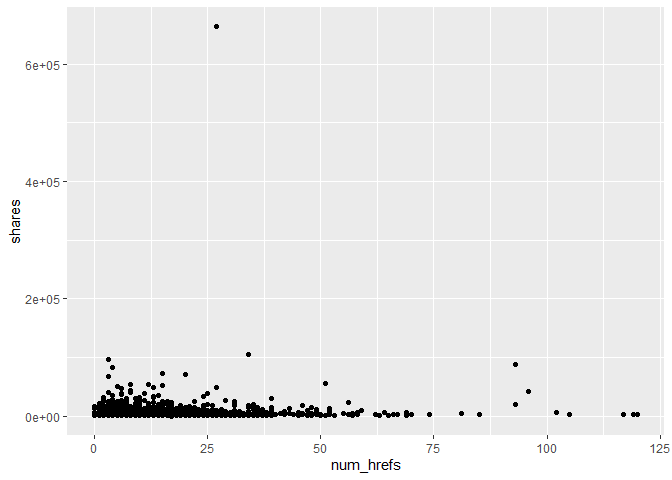
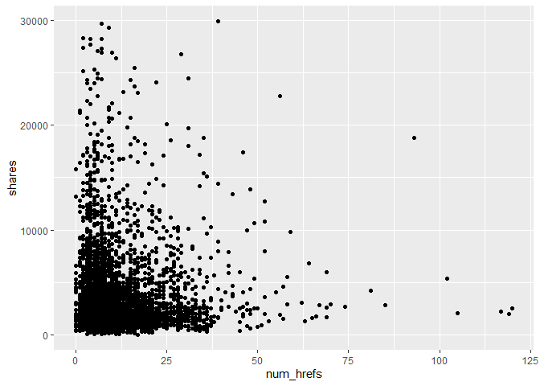
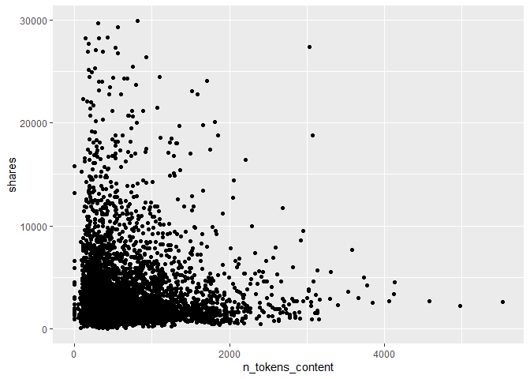

project-3
================
Justin Feathers
2022-11-01

# Introduction

Describes the data and variables we want to use. Target is `shares`

``` r
library(tidyverse)
library(corrplot)
library(caret)
library(rmarkdown)
```

# Data

``` r
newsData <- read_csv(file = "./OnlineNewsPopularity.csv")
data <- newsData %>% 
            filter(get(paste0("data_channel_is_", params$channel)) == 1) %>%
              select(-url, -timedelta)

channelIDs <- list("lifestyle", "entertainment", "bus", "socmed", "tech", "world")
output_file <- paste0(channelIDs, ".html")
parameters = lapply(channelIDs, FUN = function(x){list(channel = x)})
reports <- tibble(output_file, parameters)
```

# Summarizations

A good way of starting is by checking how strongly all variables are
correlated to the response variable of interest. I created a correlation
matrix using the `cor` function and sorted the absolute values of the
output to get a convenient tibble of descending correlation values.

From here, we can look at a correlation plot of the chosen variables to
see if multicollinearity exists between any of the variables. Using
`corrplot`, we can see that the variables `n_unique_tokens` and
`n_tokens_content` have a strong negative correlation of -0.73. There is
an extremely strong positive correlation of 0.93 between
`n_unique_tokens` and `n_non_stop_unique_tokens` – we will try dropping
`n_unique_tokens` from the dataset and reassessing. We can see in the
new `corrplot` that multicollinearity has been minimized as desired.

We can analyze a few of the variables by plotting them against `shares`.
If we create a scatter plot of `num_imgs` by `shares`, we can see an
outlier when `num_imgs` = 1. Let’s remove that.

``` r
dataCor <- cor(data$shares, data) %>%
        as.tibble() %>%
        abs() %>%
        sort(decreasing = TRUE)
dataCor
```

    ## # A tibble: 1 x 53
    ##   shares num_hrefs n_tokens_content n_unique_tokens kw_avg_avg n_non_stop_uniqu~
    ##    <dbl>     <dbl>            <dbl>           <dbl>      <dbl>             <dbl>
    ## 1      1    0.0779           0.0714          0.0538     0.0522            0.0426
    ## # ... with 47 more variables: num_videos <dbl>, min_negative_polarity <dbl>,
    ## #   rate_positive_words <dbl>, min_positive_polarity <dbl>, is_weekend <dbl>,
    ## #   rate_negative_words <dbl>, avg_negative_polarity <dbl>, kw_min_avg <dbl>,
    ## #   kw_max_avg <dbl>, max_negative_polarity <dbl>,
    ## #   title_sentiment_polarity <dbl>, global_sentiment_polarity <dbl>,
    ## #   abs_title_sentiment_polarity <dbl>, weekday_is_sunday <dbl>, LDA_00 <dbl>,
    ## #   global_rate_negative_words <dbl>, max_positive_polarity <dbl>, ...

``` r
data <- data %>% 
            select(num_hrefs, n_tokens_content, n_unique_tokens, kw_avg_avg,
                   n_non_stop_unique_tokens, num_videos, min_negative_polarity,
                   rate_positive_words, min_positive_polarity, shares)

correlation <- cor(data)
corrplot(correlation, type = "upper", tl.pos = "lt")
corrplot(correlation, type = "lower", method = "number",
         add = TRUE, diag = FALSE, tl.pos = "n")
```

<!-- -->

``` r
data <- data %>%
            select(-n_unique_tokens)

correlation <- cor(data)
corrplot(correlation, type = "upper", tl.pos = "lt")
corrplot(correlation, type = "lower", method = "number",
         add = TRUE, diag = FALSE, tl.pos = "n")
```

<!-- -->

We can see the outlier is a single point. We can find the value by using
a `summary` statement. After filtering out the outlier, we can see the
scatter plot looks much more reasonable. Based on this plot, it looks
like articles with 0 or 1 images tend to get the most shares with a
quadratic decline until hitting the local minimum at 5 images where it
changes to a positive upswing until 11 images. It looks as though
`shares` continues on a negative linear trend after that. Inspecting the
plot for `shares` vs. `n_tokens_content` seems to suggest shares tend to
decrease after articles go beyond 250-500 words. Next, the plot of
`shares` vs. `rate_positive_words` suggests that articles are far more
likely to be shared as the rate of positive words increases. Finally, we
can see quartiles and means for the variables using the `summary`
function and standard deviations with the `sd` function.

``` r
summary(data$shares)
```

    ##    Min. 1st Qu.  Median    Mean 3rd Qu.    Max. 
    ##      36    1100    1700    3072    3000  663600

``` r
noOutlier <- data %>%
             filter(shares != 663600)

g <- ggplot(noOutlier, aes(y = shares))
g + geom_point(aes(x = num_hrefs))
```

<!-- -->

``` r
g + geom_point(aes(x = n_tokens_content))
```

<!-- -->

``` r
g + geom_point(aes(x = rate_positive_words))
```

<!-- -->

``` r
summary(data)
```

    ##    num_hrefs       n_tokens_content   kw_avg_avg    n_non_stop_unique_tokens
    ##  Min.   :  0.000   Min.   :   0.0   Min.   :    0   Min.   :0.0000          
    ##  1st Qu.:  5.000   1st Qu.: 256.0   1st Qu.: 2346   1st Qu.:0.6165          
    ##  Median :  7.000   Median : 405.0   Median : 2698   Median :0.6897          
    ##  Mean   :  9.417   Mean   : 571.6   Mean   : 2746   Mean   :0.6829          
    ##  3rd Qu.: 11.000   3rd Qu.: 728.0   3rd Qu.: 3079   3rd Qu.:0.7568          
    ##  Max.   :120.000   Max.   :5530.0   Max.   :19429   Max.   :1.0000          
    ##    num_videos      min_negative_polarity rate_positive_words
    ##  Min.   : 0.0000   Min.   :-1.0000       Min.   :0.0000     
    ##  1st Qu.: 0.0000   1st Qu.:-0.6000       1st Qu.:0.6667     
    ##  Median : 0.0000   Median :-0.4000       Median :0.7524     
    ##  Mean   : 0.4472   Mean   :-0.4513       Mean   :0.7466     
    ##  3rd Qu.: 1.0000   3rd Qu.:-0.2500       3rd Qu.:0.8333     
    ##  Max.   :73.0000   Max.   : 0.0000       Max.   :1.0000     
    ##  min_positive_polarity     shares      
    ##  Min.   :0.00000       Min.   :    36  
    ##  1st Qu.:0.05000       1st Qu.:  1100  
    ##  Median :0.10000       Median :  1700  
    ##  Mean   :0.09917       Mean   :  3072  
    ##  3rd Qu.:0.10000       3rd Qu.:  3000  
    ##  Max.   :1.00000       Max.   :663600

``` r
data %>%
  sapply(sd)
```

    ##                num_hrefs         n_tokens_content               kw_avg_avg 
    ##             8.526926e+00             4.907161e+02             7.373789e+02 
    ## n_non_stop_unique_tokens               num_videos    min_negative_polarity 
    ##             1.106509e-01             1.552880e+00             2.589441e-01 
    ##      rate_positive_words    min_positive_polarity                   shares 
    ##             1.342837e-01             6.266741e-02             9.024344e+03

# Modeling

``` r
set.seed(250)
index <- createDataPartition(data$shares, p = 0.70, list = FALSE)
train <- data[index, ]
test <- data[-index, ]
```

## Multiple Linear Regression

Fitting a multiple regression model on all variables in the `data`
dataset, we can see from the `summary` function that this model is not a
very good fit with an adjusted R^2 value of 0.01 – this means only 1% of
the variance in the data is explained by the model. We need to explore
better options.

``` r
mlrFit <- train(shares ~ ., data = train,
                preProcess = c("center", "scale"),
                method = "lm",
                trControl = trainControl(method = "cv", number = 5))
mlrPredict <- predict(mlrFit, newdata = test)
temp <- postResample(mlrPredict, test$shares)
mlrRsquare <- temp[2]
mlrRsquare
```

    ##    Rsquared 
    ## 0.004651945

## Random Forest

``` r
forest <- train(shares ~ ., data = train,
                method = "rf",
                preProcess = c("center", "scale"),
                tuneGrid = data.frame(mtry = ncol(train)/3),
                trControl = trainControl(method = "cv", number = 5))
forestPredict <- predict(forest, newdata = test)
temp <- postResample(forestPredict, test$shares)
forestRsquare <- temp[2]
forestRsquare
```

    ##   Rsquared 
    ## 0.00573635

# Comparison

To compare the models, we will use a simple comparison of R^2 and choose
the one with the highest value. We will use this method since R^2 can be
interpreted as how much of the variance in the data can be explained by
the model, i.e., how well the model fits.

``` r
if (mlrRsquare > forestRsquare) {
  paste0("Multiple linear regression is the preferred model for data channel = ", params$channel)
} else {
  paste0("Random forest is the preferred model for data channel = ", params$channel)
} 
```

    ## [1] "Random forest is the preferred model for data channel = tech"
