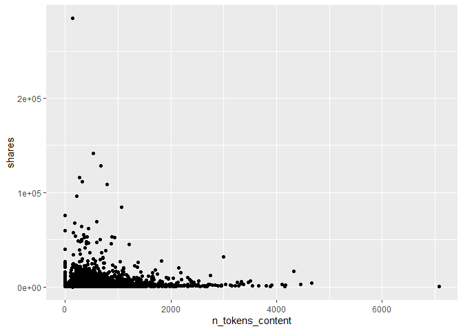
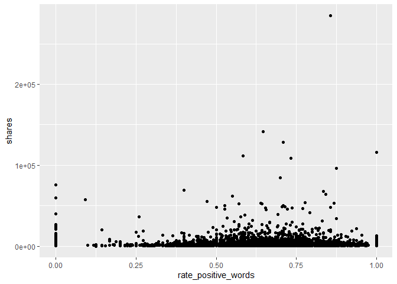

project-3
================
Justin Feathers
2022-11-01

# Introduction

Describes the data and variables we want to use. Target is `shares`

``` r
library(tidyverse)
library(corrplot)
library(caret)
```

# Data

``` r
newsData <- read_csv(file = "./OnlineNewsPopularity.csv")
data <- newsData %>% 
            filter(get(paste0("data_channel_is_", params$channel)) == 1) %>%
              select(-url, -timedelta)
```

# Summarizations

A good way of starting is by checking how strongly all variables are
correlated to the response variable of interest. I created a correlation
matrix using the `cor` function and sorted the absolute values of the
output to get a convenient tibble of descending correlation values.

From here, we can look at a correlation plot of the chosen variables to
see if multicollinearity exists between any of the variables. Using
`corrplot`, we can see that the variables `n_unique_tokens` and
`n_tokens_content` have a strong negative correlation of -0.73. There is
an extremely strong positive correlation of 0.93 between
`n_unique_tokens` and `n_non_stop_unique_tokens` – we will try dropping
`n_unique_tokens` from the dataset and reassessing. We can see in the
new `corrplot` that multicollinearity has been minimized as desired.

We can analyze a few of the variables by plotting them against `shares`.
If we create a scatter plot of `num_imgs` by `shares`, we can see an
outlier when `num_imgs` = 1. Let’s remove that.

``` r
dataCor <- cor(data$shares, data) %>%
        as.tibble() %>%
        abs() %>%
        sort(decreasing = TRUE)
dataCor
```

    ## # A tibble: 1 x 53
    ##   shares LDA_02 LDA_03 num_imgs kw_avg_avg average_token_length rate_negative_wo~ kw_max_avg n_tokens_title n_non_stop_words
    ##    <dbl>  <dbl>  <dbl>    <dbl>      <dbl>                <dbl>             <dbl>      <dbl>          <dbl>            <dbl>
    ## 1      1  0.101 0.0966   0.0804     0.0766               0.0605            0.0519     0.0434         0.0421           0.0403
    ## # ... with 43 more variables: abs_title_sentiment_polarity <dbl>, LDA_04 <dbl>, title_sentiment_polarity <dbl>,
    ## #   num_videos <dbl>, num_hrefs <dbl>, weekday_is_wednesday <dbl>, num_keywords <dbl>, title_subjectivity <dbl>,
    ## #   max_negative_polarity <dbl>, self_reference_avg_sharess <dbl>, self_reference_max_shares <dbl>,
    ## #   n_non_stop_unique_tokens <dbl>, global_sentiment_polarity <dbl>, global_rate_negative_words <dbl>, is_weekend <dbl>,
    ## #   abs_title_subjectivity <dbl>, global_subjectivity <dbl>, LDA_01 <dbl>, global_rate_positive_words <dbl>,
    ## #   self_reference_min_shares <dbl>, n_tokens_content <dbl>, weekday_is_saturday <dbl>, LDA_00 <dbl>,
    ## #   n_unique_tokens <dbl>, kw_max_min <dbl>, weekday_is_sunday <dbl>, kw_avg_max <dbl>, kw_avg_min <dbl>, ...

``` r
data <- data %>% 
            select(num_hrefs, n_tokens_content, n_unique_tokens, kw_avg_avg,
                   n_non_stop_unique_tokens, num_videos, min_negative_polarity,
                   rate_positive_words, min_positive_polarity, shares)

correlation <- cor(data)
corrplot(correlation, type = "upper", tl.pos = "lt")
corrplot(correlation, type = "lower", method = "number",
         add = TRUE, diag = FALSE, tl.pos = "n")
```

<!-- -->

``` r
data <- data %>%
            select(-n_unique_tokens)

correlation <- cor(data)
corrplot(correlation, type = "upper", tl.pos = "lt")
corrplot(correlation, type = "lower", method = "number",
         add = TRUE, diag = FALSE, tl.pos = "n")
```

<!-- -->

We can see the outlier is a single point. We can find the value by using
a `summary` statement. After filtering out the outlier, we can see the
scatter plot looks much more reasonable. Based on this plot, it looks
like articles with 0 or 1 images tend to get the most shares with a
quadratic decline until hitting the local minimum at 5 images where it
changes to a positive upswing until 11 images. It looks as though
`shares` continues on a negative linear trend after that. Inspecting the
plot for `shares` vs. `n_tokens_content` seems to suggest shares tend to
decrease after articles go beyond 250-500 words. Next, the plot of
`shares` vs. `rate_positive_words` suggests that articles are far more
likely to be shared as the rate of positive words increases. Finally, we
can see quartiles and means for the variables using the `summary`
function and standard deviations with the `sd` function.

``` r
summary(data$shares)
```

    ##    Min. 1st Qu.  Median    Mean 3rd Qu.    Max. 
    ##      35     827    1100    2288    1900  284700

``` r
noOutlier <- data %>%
             filter(shares != 663600)

g <- ggplot(noOutlier, aes(y = shares))
g + geom_point(aes(x = num_hrefs))
```

<!-- -->

``` r
g + geom_point(aes(x = n_tokens_content))
```

<!-- -->

``` r
g + geom_point(aes(x = rate_positive_words))
```

<!-- -->

``` r
summary(data)
```

    ##    num_hrefs     n_tokens_content   kw_avg_avg    n_non_stop_unique_tokens   num_videos      min_negative_polarity
    ##  Min.   :  0.0   Min.   :   0.0   Min.   :    0   Min.   :0.0000           Min.   : 0.0000   Min.   :-1.0000      
    ##  1st Qu.:  5.0   1st Qu.: 332.0   1st Qu.: 2070   1st Qu.:0.6280           1st Qu.: 0.0000   1st Qu.:-0.8000      
    ##  Median :  8.0   Median : 509.0   Median : 2404   Median :0.6837           Median : 0.0000   Median :-0.5000      
    ##  Mean   : 10.2   Mean   : 597.3   Mean   : 2525   Mean   :0.6653           Mean   : 0.5495   Mean   :-0.5607      
    ##  3rd Qu.: 13.0   3rd Qu.: 768.0   3rd Qu.: 2785   3rd Qu.:0.7350           3rd Qu.: 1.0000   3rd Qu.:-0.4000      
    ##  Max.   :161.0   Max.   :7081.0   Max.   :17839   Max.   :1.0000           Max.   :51.0000   Max.   : 0.0000      
    ##  rate_positive_words min_positive_polarity     shares      
    ##  Min.   :0.0000      Min.   :0.00000       Min.   :    35  
    ##  1st Qu.:0.5357      1st Qu.:0.05000       1st Qu.:   827  
    ##  Median :0.6429      Median :0.10000       Median :  1100  
    ##  Mean   :0.6234      Mean   :0.08849       Mean   :  2288  
    ##  3rd Qu.:0.7417      3rd Qu.:0.10000       3rd Qu.:  1900  
    ##  Max.   :1.0000      Max.   :0.80000       Max.   :284700

``` r
data %>%
  sapply(sd)
```

    ##                num_hrefs         n_tokens_content               kw_avg_avg n_non_stop_unique_tokens 
    ##             9.226685e+00             4.195604e+02             8.533302e+02             1.453257e-01 
    ##               num_videos    min_negative_polarity      rate_positive_words    min_positive_polarity 
    ##             1.560553e+00             2.809284e-01             1.867350e-01             6.072732e-02 
    ##                   shares 
    ##             6.089669e+03

# Modeling

``` r
set.seed(250)
index <- createDataPartition(data$shares, p = 0.70, list = FALSE)
train <- data[index, ]
test <- data[-index, ]
```

## Multiple Linear Regression

Fitting a multiple regression model on all variables in the `data`
dataset, we can see from the `summary` function that this model is not a
very good fit with an adjusted R^2 value of 0.01 – this means only 1% of
the variance in the data is explained by the model. We need to explore
better options.

``` r
mlrFit <- train(shares ~ ., data = train,
                preProcess = c("center", "scale"),
                method = "lm",
                trControl = trainControl(method = "cv", number = 5))
mlrPredict <- predict(mlrFit, newdata = test)
temp <- postResample(mlrPredict, test$shares)
mlrRsquare <- temp[2]
mlrRsquare
```

    ##    Rsquared 
    ## 0.002594642

## Random Forest

``` r
forest <- train(shares ~ ., data = train,
                method = "rf",
                preProcess = c("center", "scale"),
                tuneGrid = data.frame(mtry = ncol(train)/3),
                trControl = trainControl(method = "cv", number = 5))
forestPredict <- predict(forest, newdata = test)
temp <- postResample(forestPredict, test$shares)
forestRsquare <- temp[2]
forestRsquare
```

    ##    Rsquared 
    ## 0.003748422

# Comparison

To compare the models, we will use a simple comparison of R^2 and choose
the one with the highest value. We will use this method since R^2 can be
interpreted as how much of the variance in the data can be explained by
the model, i.e., how well the model fits.

``` r
if (mlrRsquare > forestRsquare) {
  paste0("Multiple linear regression is the preferred model for data channel = ", params$channel)
} else {
  paste0("Random forest is the preferred model for data channel = ", params$channel)
} 
```

    ## [1] "Random forest is the preferred model for data channel = world"
